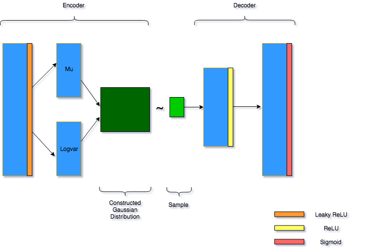
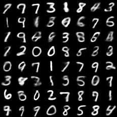

{\rtf1\ansi\ansicpg1252\cocoartf1504\cocoasubrtf830
{\fonttbl\f0\fmodern\fcharset0 Courier;}
{\colortbl;\red255\green255\blue255;\red0\green0\blue0;}
{\*\expandedcolortbl;;\cssrgb\c0\c0\c0;}
\margl1440\margr1440\vieww10800\viewh8400\viewkind0
\deftab720
\pard\pardeftab720\sl280\partightenfactor0

\f0\fs24 \cf2 \expnd0\expndtw0\kerning0
\outl0\strokewidth0 \strokec2 # Variational Autoencoder in NumPy\
This is a full implementation of a simple VAE written entirely in Numpy (and Cupy). The code runs very slow on CPU so using a GPU with Cupy is recommended. \
\
Original Paper: [Auto-Encoding Variational Bayes]({\field{\*\fldinst{HYPERLINK "https://arxiv.org/abs/1312.6114"}}{\fldrslt https://arxiv.org/abs/1312.6114}}), Diederik P Kingma, Max Wellington\
\
Used preprocessing code and inspired by [@shinseung428](http://shinseung428.github.io)\'92s Vanilla GAN. \
\
### Implementation Details\
* Learns the MNIST Dataset\
* Xavier Initialization\
* Adam Optimizer \
\
### Requirements  \
* Numpy  \
* PIL (visualize results)\
* Cupy (Optional)\
\
## Network  \
\
\
## Results\
\
\
\
## Author  \
K / [@kwj2104]({\field{\*\fldinst{HYPERLINK "https://twitter.com/kwj2104"}}{\fldrslt https://twitter.com/kwj2104}})\
}